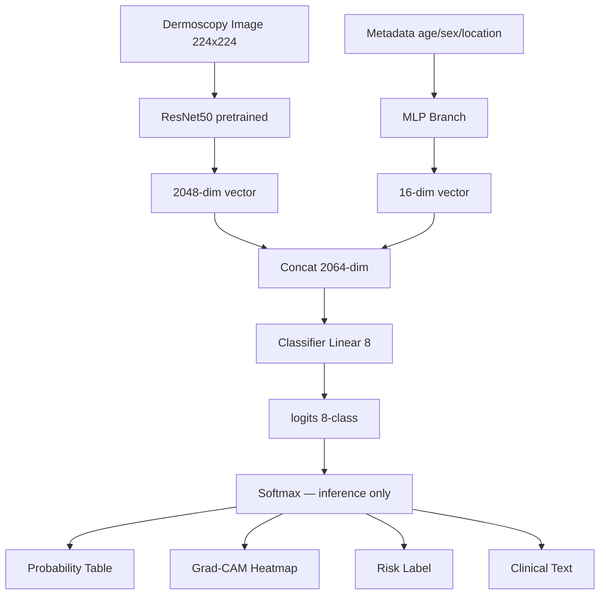

# ISIC 2019 — Multimodal Skin Lesion Classification
> **Hệ thống AI Phân loại Tổn thương Da liễu Đa phương thức**

**Tác giả:**  
**Phiên bản:** 1.0  
**Ngày tạo:*10/06/2026*  
**Cập nhật lần cuối:**  

---

## PHẦN 1 — PROJECT BRIEF

**Tên dự án:** Multimodal Skin Lesion Classification System  
**Bộ dữ liệu:** ISIC 2019 (25,331 ảnh dermoscopy, 8 lớp bệnh lý)

**Bài toán:**  
Xây dựng hệ thống AI phân loại 8 loại bệnh lý da liễu từ ảnh dermoscopy kết hợp metadata lâm sàng (tuổi, giới tính, vị trí tổn thương), tập trung vào việc phân biệt chính xác ung thư hắc tố (Melanoma) với nốt ruồi lành tính (Nevi).

**Giá trị thực tế:**  
Ung thư hắc tố nếu phát hiện muộn có tỷ lệ tử vong cao, nhưng nếu phát hiện sớm thì tỷ lệ sống sót trên 95%. Hệ thống giúp bác sĩ da liễu sàng lọc nhanh hơn, giảm tỷ lệ bỏ sót ca ác tính, đặc biệt hữu ích ở các cơ sở thiếu chuyên gia.

**Người dùng mục tiêu:**  
Bác sĩ da liễu và kỹ thuật viên y tế tại phòng khám. Hệ thống đóng vai trò công cụ hỗ trợ quyết định lâm sàng (CDSS), không thay thế chẩn đoán của bác sĩ.

**Ngoài phạm vi (out-of-scope):**
- Không tích hợp với hệ thống HIS/EMR
- Không hỗ trợ ảnh ngoài định dạng dermoscopy (ảnh điện thoại thông thường không được kiểm định)
- Không dùng cho cơ sở thiếu kết nối internet ổn định
- Không thay thế chẩn đoán lâm sàng — chỉ là công cụ hỗ trợ (CDSS)
- Không áp dụng cho bệnh nhân nhi (dữ liệu ISIC 2019 chủ yếu người trưởng thành)

**Thể hiện trong portfolio:**
- Multimodal deep learning (CNN + MLP fusion)
- Xử lý class imbalance nặng trong y tế
- Explainable & Reliable AI (Grad-CAM + Calibration Analysis)
- End-to-end: từ data pipeline đến deploy Streamlit
- Đánh giá theo tiêu chuẩn y khoa (Sensitivity, 95% CI, McNemar test)

---

## PHẦN 2 — DATA CARD

**2.1 — Nguồn dữ liệu:**  
ISIC 2019 Challenge Dataset, tổng hợp từ 3 nguồn: BCN_20000, HAM10000, MSK Dataset.  
Kaggle: `alifshahariar/isic-2019-dataset-full`

**2.2 — Quy mô:**  
25,331 ảnh dermoscopy chất lượng cao + 1 file CSV metadata lâm sàng + 1 file csv GroudTrush từ bác sĩ

**2.3 — Cấu trúc CSV:**

| Cột | Kiểu | Mô tả |
|---|---|---|
| image | string | Tên file ảnh |
| MEL, NV, BCC, AK, BKL, DF, VASC, SCC | float | One-hot label 8 lớp |
| age_approx | float | Tuổi bệnh nhân, có NaN |
| sex | string | Giới tính, có NaN |
| anatom_site_general | string | Vị trí tổn thương, có NaN |
| lesion_id | string | Mã bệnh nhân (1 BN có nhiều ảnh) |

**2.4 — Phân phối nhãn:**

| Lớp | Số lượng | Tỷ lệ |
|---|---|---|
| NV (Nốt ruồi lành) | ~12,875 | ~51% |
| MEL (Ung thư hắc tố) | ~4,522 | ~18% |
| BCC | ~3,323 | ~13% |
| BKL | ~2,624 | ~10% |
| AK, DF, VASC, SCC | ~987 | ~8% còn lại |

**2.4b — EDA Insights lâm sàng:**

| Chiều phân tích | Insight |
|---|---|
| Tuổi vs Loại bệnh | MEL tập trung ở nhóm 45-65 tuổi, NV phổ biến nhất ở nhóm 20-40 tuổi |
| Vị trí vs Loại bệnh | Lưng/thân mình → MEL hoặc NV; Mặt → BCC và AK (tiền ung thư) |
| Giới tính vs Loại bệnh | MEL gặp nhiều ở nam hơn nữ; DF ngược lại, gặp nhiều ở nữ hơn |

> Các insight này là cơ sở để chứng minh metadata lâm sàng có giá trị thực sự khi kết hợp với ảnh.

**2.5 — Thách thức đã biết:**
- Class imbalance cực nặng: NV chiếm 51%, ta không thể dùng train_test_split(sktlearn) vì nó chia random,
 dùng StratifiedGroupKFold để đảm bảo chia cân bằng
- Cặp MEL vs NV hình thái học rất giống nhau trên ảnh dermoscopy
- Metadata có NaN: age_approx ~8%, sex ~4%, anatom_site_general ~10% (ước tính, cần verify lại bằng df.isnull().sum())
- 1 bệnh nhân có nhiều ảnh → phải split theo lesion_id không phải image_id

**2.5b — Chất lượng ảnh:**
- Định dạng: JPEG
- Độ phân giải: đa dạng (từ ~600×450 đến ~1024×1024), cần resize về 224×224 khi đưa vào model
- Color space: RGB
- Nguồn máy chụp: dermoscope kỹ thuật số từ nhiều thiết bị khác nhau (BCN, HAM, MSK) → có thể có domain shift giữa các nguồn

**2.6 — Ràng buộc:**
- Dữ liệu đã ẩn danh hóa, chỉ dùng cho mục đích nghiên cứu và học thuật
- Không dùng cho chẩn đoán lâm sàng thực tế khi chưa được kiểm định y tế

---

## PHẦN 3 — TECHNICAL DESIGN

**3.1 — Kiến trúc mô hình:**

> **Lý do chọn ResNet50:** Được sử dụng rộng rãi trong tài liệu ISIC (baseline phổ biến nhất để so sánh), nhẹ hơn EfficientNet-B7, Grad-CAM hoạt động tốt hơn so với ViT, phù hợp với GPU free tier của Kaggle. Có thể upgrade lên EfficientNet-B3 ở iteration sau nếu kết quả chưa đạt.

```
Ảnh (224x224x3)                    Metadata (vector)
      ↓                                   ↓
ResNet50 pretrained                  MLP Branch
(freeze block1-3,                  Linear(n → 64)
 unfreeze layer4+fc)                BatchNorm1d(64)
      ↓                             ReLU + Dropout(0.3)
 2048 dim vector                    Linear(64 → 16)
      ↓                                   ↓
      └──────────── concat ──────────────┘
                       ↓
                  2064 dim vector
                       ↓
              Linear(2064 → 512)
                       ↓
              BatchNorm1d(512)
                       ↓
              ReLU + Dropout(0.3)
                       ↓
               Linear(512 → 8)
                       ↓
                 logits(8 lớp)
```

**3.2 — Chiến lược xử lý imbalance:**
- Focal Loss + Class Weights (phạt nặng khi sai lớp hiếm)
- Threshold shifting: MEL threshold DEFAULT = 0.35 (thay vì 0.5)
  → Fallback nếu Recall chưa đạt: xem bậc fallback ở mục 7.6 / R04 (12.1)
- Augmentation mạnh cho lớp thiểu số

**3.3 — Data Split:**
- StratifiedGroupKFold 5-fold
- Group = lesion_id (tránh data leakage theo bệnh nhân)
- Stratify = label (giữ tỷ lệ 8 lớp đồng đều)
- Tập Test khóa từ đầu, không bao giờ dùng để tune model

**3.4 — Training config:**

| Thành phần | Lựa chọn |
|---|---|
| Optimizer | Adam, lr=1e-4 |
| Scheduler | CosineAnnealingLR, T_max=30 |
| Batch size | 32 |
| Epochs | 30 (max) |
| Early stopping | patience=7, monitor=val Macro-F1 |
| Gradient clipping | max_norm=1.0 |
| Seed | 42 (torch, numpy, random, CUDA) |
| Môi trường train | Kaggle (GPU free) |


**3.5 — Explainability & Reliability:**
- Grad-CAM: trực quan hóa vùng ảnh ảnh hưởng nhiều nhất đến quyết định của model
  (target layer = layer4[-1] của ResNet50)

- Reliability Diagram:
  so sánh xác suất dự đoán với độ chính xác thực tế,
  đánh giá mức độ hiệu chuẩn (calibration) của mô hình.

- Expected Calibration Error (ECE):
  đo khoảng cách trung bình giữa confidence và accuracy.

- Temperature Scaling:
  hậu xử lý logits trên tập validation để cải thiện calibration
  mà không làm thay đổi độ chính xác phân loại.

**3.6 — Stack kỹ thuật:**

| Mục | Tool |
|---|---|
| Deep learning | PyTorch |
| Augmentation | Albumentations |
| Experiment tracking | W&B |
| Data versioning | DVC + Google Drive (chỉ model checkpoint .pth) |
| App | Streamlit |
| Deploy | Streamlit Cloud |
| Repo | GitHub |

**3.7 — Baseline vs Multimodal:**
- Chạy tuần tự: Baseline (M2) trước, Multimodal (M3) sau — cùng seed, cùng fold, cùng tập test  
- Baseline: ResNet50 chỉ nhận ảnh
- Multimodal: ResNet50 + MLP fusion
- So sánh bằng McNemar test, chỉ công nhận cải tiến khi p < 0.05

---

## PHẦN 4 — ENVIRONMENT SETUP

**4.1 — Cấu trúc thư mục:**

```
isic2019-skin-lesion/
├── data/                    ← KHÔNG commit (ảnh lấy từ Kaggle Dataset)
│   ├── raw/                 ← ảnh gốc ISIC2019 (Kaggle Dataset, không lưu local)
│   └── processed/           ← CSV sau khi clean
├── notebooks/               ← chỉ nháp EDA, không chứa logic
├── src/
│   ├── preprocessing.py     ← encode metadata, transform
│   ├── dataset.py           ← Custom PyTorch Dataset
│   ├── model.py             ← định nghĩa BaselineModel + MultimodalNet
│   ├── train.py             ← training loop
│   └── evaluate.py          ← metrics, McNemar, bootstrap
├── models/                  ← KHÔNG commit (DVC quản lý)
├── reports/
│   └── figures/             ← confusion matrix, plots
├── docs/
│   ├── project_plan.md      ← file này
│   └── experiment_log.md    ← ghi chép từng run
├── app.py                   ← Streamlit app
├── requirements.txt         ← full deps cho development
├── requirements_deploy.txt  ← deps tối giản cho Streamlit Cloud
├── .gitignore
├── .dvc/
└── README.md
```

**4.2 — .gitignore:**

```
data/
models/
venv/
__pycache__/
*.pth
*.pt
*.pkl
.env
.ipynb_checkpoints/
wandb/
```

**4.3 — Requirements.txt:**

```
torch==2.4.1
torchvision==0.19.1
numpy==1.26.4
opencv-python==4.8.0.76
albumentations>=1.4.0
scikit-learn==1.3.2
pandas==2.1.4
joblib==1.3.2
streamlit==1.38.0
wandb==0.18.0
grad-cam==1.4.8
python-dotenv==1.0.1
dvc==3.55.0
```

**4.4 — Checklist setup:**

```
[x] 1.  Tạo cấu trúc thư mục
[x] 2.  Tạo .gitignore
[x] 3.  git init + tạo repo GitHub + git push
[x] 4.  Tạo venv, activate, pip install requirements.txt
[x] 5.  dvc init (chỉ để track model checkpoint .pth)
[x] 6.  dvc remote add Google Drive (chỉ cho models/)
[x] 7.  Kết nối ISIC 2019 Kaggle Dataset vào Kaggle Notebook
[x] 8.  git add .dvc + commit + push
[x] 9. Xác nhận dataset đọc được từ /kaggle/input/ trên Notebook
[x] 10. Tạo project trên W&B, lưu API key vào .env
[x] 11. Tạo Kaggle Notebook
[x] 12. Clone GitHub Repo
[x] 13. Kết nối ISIC 2019 Kaggle Dataset
[x] 14. Tạo thư mục docs/, lưu project_plan.md
```

> Không được chuyển sang Phần 5 nếu chưa tick xong mục 1→10.

---

## PHẦN 5 — DATA PIPELINE SPEC

**5.1 — Tổng quan luồng dữ liệu:**

```
Kaggle Dataset (ảnh + CSV)
        ↓
   preprocessing.py
        ↓
   Load + Inspect CSV
        ↓
      EDA        ← bổ sung
        ↓
  fillna sex/anatom_site_general → 'unknown'
        ↓
  Encode Metadata (One-Hot only, KHÔNG fit Scaler)
        ↓
  StratifiedGroupKFold (group=lesion_id)
        ↓
    ┌───┴───┐
  Train    Test (khóa)
    ↓
  Tính median_age TRÊN TRAIN
  → fillna(age_approx) cho cả Train + Test
        ↓
  Lưu metadata_processed.csv
  + median_age.pkl + feature_cols.pkl
        ↓
   dataset.py
        ↓
  Dataset + DataLoader
        ↓
  Augmentation (train only)
  Normalize (tất cả)
        ↓
   train.py
        ↓
  Fit StandardScaler trên Train Fold
  → Transform Val Fold
  → Training Loop
        ↓
  Tensor → Model
```

**5.2 — Bước 1: Load + Inspect**

```
Input  : ISIC_2019_Training_Metadata.csv
         ISIC_2019_Training_GroundTruth.csv
Output : df_meta, df_gt đã merge

Kiểm tra:
- df.info()                    → kiểu dữ liệu từng cột
- df.isnull().sum()            → đếm NaN từng cột
- df['label'].value_counts()   → phân phối 8 lớp
- assert không có image_id trùng nhau
```

**5.2b — Bước 1b: EDA (sau khi merge, trước khi xử lý null)**

```
Mục đích : Hiểu dữ liệu thực tế trước khi can thiệp,
           xác minh các insights lâm sàng đã ghi ở mục 2.4b,
           verify % NaN thực tế (so với ước tính ở mục 2.5)

── Phân phối nhãn ──────────────────────────────────────────
df['label'].value_counts(normalize=True)
→ Bar chart ngang 8 lớp (count + %)
→ Xác nhận NV ~51%, MEL ~18%, imbalance ratio NV:SCC

── Phân tích NaN thực tế ───────────────────────────────────
df.isnull().sum() / len(df) * 100
→ So sánh với ước tính: age ~8%, sex ~4%, anatom_site ~10%
→ Nếu lệch nhiều: cập nhật lại mục 2.5

── Tuổi vs Loại bệnh ───────────────────────────────────────
sns.boxplot(data=df, x='label', y='age_approx')
→ Kỳ vọng: MEL tập trung 45-65 tuổi, NV tập trung 20-40 tuổi
→ Chú ý: vẽ trên df chưa fillna (NaN vẫn bị bỏ qua tự động)

── Giới tính vs Loại bệnh ──────────────────────────────────
pd.crosstab(df['label'], df['sex'], normalize='index') * 100
→ Stacked bar chart
→ Kỳ vọng: MEL nhiều ở nam hơn nữ, DF ngược lại

── Vị trí tổn thương vs Loại bệnh ─────────────────────────
pd.crosstab(df['label'], df['anatom_site_general'],
            normalize='index') * 100
→ Heatmap (seaborn)
→ Kỳ vọng: lưng/thân mình → MEL/NV, mặt → BCC/AK

Output : Không lưu file, chỉ hiển thị inline trong notebook
Ghi chú: Nếu insight thực tế lệch với kỳ vọng ở 2.4b
         → cập nhật lại mục 2.4b trước khi tiếp tục
```

**5.3 — Bước 2: Xử lý null**

```
⚠ THỨ TỰ BẮT BUỘC để tránh data leakage:
   Split train/test (5.5) PHẢI thực hiện TRƯỚC khi tính median_age.
   Bước này (5.3) chỉ áp dụng SAU KHI đã có train_df/test_df.

sex                 → fillna('unknown')                     [áp dụng cho cả train + test]
anatom_site_general → fillna('unknown')                     [áp dụng cho cả train + test]

age_approx (chỉ sau khi đã split):
  - Tính median_age CHỈ trên train_df → lưu ra models/median_age.pkl
  - fillna(median_age) cho CẢ train_df VÀ test_df bằng median_age này
    (test_df KHÔNG được dùng để tính median)

Sau khi xử lý:
- assert df['age_approx'].isnull().sum() == 0
- assert df['sex'].isnull().sum() == 0
- assert df['anatom_site_general'].isnull().sum() == 0
```

**5.4 — Bước 3: Encode Metadata**

```
age_approx → GIỮ NGUYÊN (chưa scale ở bước này)
             StandardScaler sẽ được fit trong train.py trên Train Fold

sex + anatom_site_general → pd.get_dummies (One-Hot)
             lưu expected_cols ra models/feature_cols.pkl

Bỏ cột: lesion_id (sau khi split xong)
Giữ lại: age_approx dạng raw để train.py tự scale

Output: metadata_processed.csv với age_approx chưa scale
```

**5.5 — Bước 4: Data Split**

```
Bước 1 — Tách Test set cố định (1 lần duy nhất, khóa đến M4):
  StratifiedGroupKFold(n_splits=5), lấy fold 0 làm test
  → test_df  : ~20% dữ liệu (không bao giờ dùng để tune model)
  → trainval_df: ~80% dữ liệu

Bước 2 — Cross-validation trên trainval_df (chỉ để chọn hyperparameter):
  StratifiedGroupKFold(n_splits=5) trên trainval_df
  → Mỗi fold: ~64% train / ~16% val
  → Chạy 5 folds, lấy trung bình val Macro-F1 để so sánh config

Bước 3 — Train model cuối:
  Dùng toàn bộ trainval_df (80%), đánh giá 1 lần duy nhất trên test_df

Sau khi split:
- reset_index(drop=True) cả 2 tập
- assert len(set(train_df['lesion_id']) &set(test_df['lesion_id'])) == 0
- assert test_df['label'].nunique() == 8
```

**5.6 — Bước 5: Dataset + DataLoader**

```
Custom Dataset (src/dataset.py):
- __init__   : nhận df + transform
- __len__    : len(df)
- __getitem__:
    1. đọc ảnh bằng cv2.imread
    2. cv2.cvtColor BGR→RGB       ← bắt buộc
    3. fallback nếu ảnh None: trả về ảnh đen np.zeros((224,224,3))
       + log warning với tên file để debug sau
    4. apply transform
    5. lấy metadata vector
    6. lấy label
    7. return img_tensor, meta_tensor, label

DataLoader:
- batch_size  = 32
- shuffle     = True (train) / False (val/test)
- num_workers = 0 (Windows) / 2 (Kaggle/Linux)
- Xử lý imbalance train: Focal Loss + Class Weights (chiến lược chính)
  → WeightedRandomSampler: CHỈ dùng nếu sau M2 model vẫn predict toàn NV
  → Không dùng cả 3 cùng lúc — sẽ over-correct và underfit lớp đa số
  → Thứ tự thử: Focal Loss → thêm Class Weights → thêm Sampler nếu vẫn chưa đủ
```

**5.7 — Bước 6: Transform**

```
TRAIN transform (lớp phổ biến NV, MEL, BCC, BKL):
  A.Resize(224, 224)
  A.HorizontalFlip(p=0.5)
  A.RandomRotate90(p=0.5)
  A.ColorJitter(p=0.3)
  A.Normalize(ImageNet mean/std)
  ToTensorV2()

TRAIN transform bổ sung (lớp thiểu số AK, DF, VASC, SCC):
  Thêm vào trên:
  A.ShiftScaleRotate(p=0.5)
  A.Affine(shear=(-15, 15), p=0.3),
  A.GridDistortion(p=0.3)
→ Áp dụng thông qua conditional augment trong Dataset.__getitem__:
     if label in [AK, DF, VASC, SCC]: apply heavy_transform
     else: apply standard_transform
     (KHÔNG dùng WeightedRandomSampler ở đây — xem chiến lược mục 5.6)

VAL/TEST/INFERENCE (INFERENCE_TRANSFORM):
  A.Resize(224, 224)
  A.Normalize(ImageNet mean/std)
  ToTensorV2()

Lưu ý: INFERENCE_TRANSFORM định nghĩa 1 lần
        trong dataset.py, dùng chung
        cho train.py và app.py
        (preprocessing.py KHÔNG chứa Albumentations)
```

**5.8 — Sanity Check trước khi train**

```
Chạy trên 50 ảnh mẫu, kiểm tra:
[x] img_tensor.shape[0]  <= 32   (50 ảnh / batch_size=32 → batch cuối còn 18,
                                   KHÔNG dùng == 32; hoặc set drop_last=True)
[x] img_tensor.shape[1:] == (3, 224, 224)
[x] meta_tensor.shape[0] == img_tensor.shape[0]
[x] meta_tensor.shape[1] == n_features
[x] label.shape[0]       == img_tensor.shape[0]
[x] img_tensor.dtype  == torch.float32
[x] meta_tensor.dtype == torch.float32
[x] label.dtype       == torch.int64
[x] img pixel range   ≈ [-2.5, 2.5] sau normalize
[x] Tất cả lớp có trong sample đều xuất hiện trong 200 batch đầu

```

**5.9 — Files cần lưu sau Pipeline:**

```
data/processed/
└── metadata_processed.csv   ← OUTPUT CHÍNH của preprocessing.py

models/
├── median_age.pkl    ← median tuổi từ train (dùng khi inference thiếu tuổi)
├── feature_cols.pkl  ← danh sách cột one-hot đúng thứ tự
└── scaler.pkl        ← StandardScaler fit trong train.py (KHÔNG phải preprocessing.py)
```

**5.10 — Phân chia trách nhiệm các file src/:**
```
| File | Trách nhiệm | KHÔNG chứa |
|---|---|---|
| preprocessing.py | Load CSV, Merge, EDA, Xử lý NaN, One-Hot Encode, StratifiedGroupKFold, lưu metadata_processed.csv + median_age.pkl + feature_cols.pkl | OpenCV, PIL, Albumentations, Dataset Class, DataLoader, Training Logic, StandardScaler fit |
| dataset.py | Dataset Class, đọc ảnh (cv2), Albumentations transform, Tensor conversion, INFERENCE_TRANSFORM | Preprocessing logic, Training loop |
| train.py | Training loop, Validation loop, Fit StandardScaler trên Train Fold, Early stopping, Checkpoint, Class Weight, Focal Loss | Ảnh processing, Preprocessing CSV |
| model.py | BaselineModel, MultimodalNet, load_model() | Training loop, Loss, Optimizer |
| evaluate.py | Metrics, Confusion Matrix, ROC-AUC, McNemar test, Bootstrapping CI, Classification report | Training logic |

```
**5.11 — Model Spec (src/model.py):**

```
File     : src/model.py
Chứa     : BaselineModel + MultimodalNet + load_model()
KHÔNG chứa: training loop, loss, optimizer

Đầu vào cần biết từ Pipeline:
- meta_dim    = len(feature_cols)  ← lấy từ models/feature_cols.pkl
- num_classes = 8

──────────────────────────────────────────
BaselineModel
──────────────────────────────────────────
- Load ResNet50(pretrained=True)
- Freeze  : layer1, layer2, layer3
- Unfreeze: layer4 + fc
- Thay fc : Linear(2048 → 8)
- Forward(img) → logits (B, 8)

──────────────────────────────────────────
MultimodalNet
──────────────────────────────────────────
CNN Branch:
  ResNet50(pretrained=True), cùng freeze strategy
  Bỏ fc gốc → 2048-dim vector

MLP Branch:
  Linear(meta_dim → 64)
  BatchNorm1d(64)
  ReLU
  Dropout(0.3)
  Linear(64 → 16)

Fusion:
  concat(2048 + 16) = 2064-dim
  Linear(2064 → 512)
  BatchNorm1d(512)
  ReLU
  Dropout(0.3)
  Linear(512 → 8)

Forward(img, meta) → logits (B, 8)

──────────────────────────────────────────
load_model() helper
──────────────────────────────────────────
- Nhận  : model_class, path, meta_dim, device
- Trả về: model đã load weights, ở eval mode
- Dùng  : evaluate.py + app.py

──────────────────────────────────────────
Lưu ý quan trọng
──────────────────────────────────────────
- Output là logits, KHÔNG qua Softmax
  → Focal Loss / CrossEntropy nhận logits trực tiếp
  → Softmax chỉ dùng khi inference trong app.py
- Khởi tạo:
    BaselineModel(num_classes=8)
    MultimodalNet(meta_dim=n, num_classes=8)
```

---

## PHẦN 6 — EXPERIMENT TRACKING PLAN

**6.1 — Công cụ: Weights & Biases (W&B)**

```
Project name: "isic2019-skin-lesion"
Mỗi lần train = 1 Run riêng biệt

Đặt tên run:
  - baseline_resnet50_fold1
  - multimodal_fold1_focal_loss
  - multimodal_fold1_threshold035

Khi mất kết nối internet (Kaggle):
  wandb.init(mode="offline")
  → Sync sau bằng: wandb sync ./wandb/offline-run-*
```

**6.2 — Log theo từng Epoch:**

```python
wandb.log({
    "train/loss"        : train_loss,
    "val/loss"          : val_loss,
    "val/accuracy"      : val_acc,
    "val/macro_f1"      : macro_f1,
    "val/macro_auc"     : macro_auc,
    "val/mel_recall"    : mel_recall,
    "val/mel_precision" : mel_precision,
    "train/learning_rate": current_lr,
    "epoch"             : epoch
})
```

**6.3 — Log cuối Training:**

```python
# Confusion matrix
wandb.log({"confusion_matrix": wandb.plot.confusion_matrix(
    y_true=true_labels,
    preds=pred_labels,
    class_names=LABEL_COLS
)})

# F1 từng lớp
wandb.log({f"test/{cls}_f1": f1_per_class[cls] for cls in LABEL_COLS})

# Grad-CAM samples
wandb.log({"gradcam_samples": [wandb.Image(img) for img in cam_samples]})
```

**6.4 — Checkpoint Strategy:**

```python
checkpoint = {
    'epoch'          : epoch,
    'model_state'    : model.state_dict(),
    'optimizer_state': optimizer.state_dict(),
    'best_val_f1'    : best_val_f1,
    'config'         : CONFIG
}
# Lưu khi val Macro-F1 tốt hơn best
# Đẩy lên Google Drive qua DVC ngay sau đó
```

**6.5 — Experiment Comparison Table:**

| Run | Macro-F1 | Macro-AUC | MEL Recall | Threshold | p-value |
|---|---|---|---|---|---|
| Baseline (image only) | - | - | - | 0.5 | - |
| Multimodal | - | - | - | 0.5 | McNemar vs Baseline |
| Multimodal + threshold | - | - | - | 0.35 | - |

> Điều kiện công nhận:
>
> * Delta Macro-F1 ≥ 3%
> * MEL Recall đạt khoảng 80–85% hoặc cải thiện so với Baseline
>
> McNemar test chỉ so sánh Baseline 0.5 vs Multimodal 0.5 (cùng threshold) nhằm đánh giá đóng góp của metadata.
>
> Nếu p < 0.05:
> cải thiện có ý nghĩa thống kê.
>
> Nếu p ≥ 0.05 nhưng Delta Macro-F1, Balanced Accuracy hoặc MEL Recall cải thiện ổn định,
> kết quả vẫn được xem là có giá trị thực tiễn và đáng báo cáo.
>
> Threshold shift 0.35 được đánh giá riêng bằng MEL Recall và không sử dụng trong McNemar test.


**6.6 — Config:**

```python
CONFIG = {
    "model"        : "multimodal",
    "backbone"     : "resnet50",
    "lr"           : 1e-4,
    "batch_size"   : 32,
    "epochs"       : 30,
    "mel_threshold": 0.35,  # DEFAULT — xem fallback bậc 1 (0.30) / bậc 2 (0.25) ở mục 7.6, R04 (12.1)
    "n_folds"      : 5,
    "seed"         : 42,
    "loss"         : "focal",
    "img_size"     : 224
}
```

**6.7 — Experiment Log (docs/experiment_log.md):**

```markdown
## Run: <tên run>
**Date:** dd/mm/yyyy
**Config:** lr=?, batch=?, epoch=?, loss=?, threshold=?
**Result:**
- Macro-F1  : 0.xx
- Macro-AUC : 0.xx
- MEL Recall: 0.xx
**Observation:** (nhận xét ngắn)
**Next step:** (việc cần làm tiếp)
```

---

## PHẦN 7 — MILESTONE & DONE CRITERIA

**7.1 — Tổng quan:**

```
M0: Nền móng         ← bắt đầu từ đây
M1: Data Pipeline
M2: Baseline Model
M3: Multimodal Model
M4: Evaluation
M5: Streamlit App
M6: Deploy + Portfolio
```

**7.2 — Chi tiết:**

**M0 — Nền móng** | Thời gian: 1 ngày
```
[x] Cấu trúc thư mục đúng chuẩn
[x] .gitignore hoạt động, không commit data/models
[x] DVC push data lên Google Drive thành công
[x] Sample 50 ảnh đã có sẵn để test pipeline
[x] W&B project đã tạo, API key đã lưu .env
[x] Kaggle notebook clone repo được
```

**M1 — Data Pipeline** | Thời gian: 2-3 ngày
```
[x] encode_metadata() chạy đúng, lưu scaler/median/cols
[x] StratifiedGroupKFold không bị data leakage
[x] assert giao tập train-test = rỗng
[x] assert test có đủ 8 lớp
[x] Sanity check batch shape đúng hết
[x] Chạy thông trên 50 ảnh mẫu, không lỗi
```

**M2 — Baseline Model** | Thời gian: 2-3 ngày
```
[ ] src/model.py có BaselineModel
[ ] Train 1 fold trên Kaggle, W&B log đủ metrics
[ ] Có checkpoint best_baseline.pth
[ ] Ghi kết quả vào experiment_log.md
[ ] Macro-F1 > 0.60 (ngưỡng tối thiểu để tiếp tục)
```

**M3 — Multimodal Model** | Thời gian: 3-5 ngày
```
[ ] src/model.py có MultimodalNet
[ ] Focal Loss + Class Weights tích hợp
[ ] Train 5 folds trên Kaggle
[ ] Delta Macro-F1 ≥ 3% so với Baseline
[ ] MEL Recall đạt khoảng 80–85%
    hoặc cải thiện so với Baseline
[ ] Có checkpoint best_multimodal.pth
```

**M4 — Evaluation** | Thời gian: 2-3 ngày
```
[ ] Chạy trên tập Test đã khóa từ M1
[ ] Macro-AUC ≥ 0.88
[ ] MEL Recall đạt khoảng 80–85% hoặc cải thiện so với Baseline
[ ] Hoàn thành McNemar Test
[ ] Báo cáo p-value và diễn giải kết quả
[ ] Bootstrapping 1000 lần, 95% CI ≤ ±2.5%
[ ] Grad-CAM heatmap hợp lý về mặt y khoa
[ ] Reliability Diagram được tạo
[ ] ECE được tính toán
[ ] Temperature Scaling cải thiện calibration
```

**M5 — Streamlit App** | Thời gian: 3-4 ngày
```
[ ] Upload ảnh + nhập metadata → ra kết quả
[ ] Hiển thị đủ 4 output: xác suất, heatmap, risk label, văn bản
[ ] @st.cache_resource hoạt động, không RAM leak
[ ] Missing metadata không crash app
[ ] Inference time < 3 giây
[ ] Chạy ổn định 10 ảnh liên tiếp không sập
```

**M6 — Deploy + Portfolio** | Thời gian: 1-2 ngày
```
[ ] App deploy trên Streamlit Cloud, link public
[ ] README.md tiếng Anh đầy đủ 5 mục
[ ] Mermaid diagram kiến trúc model trong README
[ ] GIF demo đính kèm đầu README
[ ] docs/ hoàn chỉnh tất cả phần
[ ] GitHub repo clean, commit message rõ ràng
[ ] Không có data/models nào bị commit nhầm
```

**7.3 — Tổng thời gian ước tính:**

```
M0 : 1 ngày
M1 : 2-3 ngày
M2 : 2-3 ngày
M3 : 3-5 ngày
M4 : 2-3 ngày
M5 : 3-4 ngày
M6 : 1-2 ngày
─────────────
Tổng: 14-21 ngày (part-time ~3-4h/ngày)
```

**7.4 — Timeline (điền ngày bắt đầu thực tế):**

| Milestone | Bắt đầu | Deadline | Buffer |
|---|---|---|---|
| M0 | __ / __ | __ / __ | +1 ngày |
| M1 | __ / __ | __ / __ | +1 ngày |
| M2 | __ / __ | __ / __ | +2 ngày |
| M3 | __ / __ | __ / __ | +2 ngày |
| M4 | __ / __ | __ / __ | +1 ngày |
| M5 | __ / __ | __ / __ | +2 ngày |
| M6 | __ / __ | __ / __ | +1 ngày |

**7.5 — Quy tắc:**
- Không chuyển Milestone tiếp khi chưa tick đủ Done Criteria
- Nếu M2 Macro-F1 < 0.60 thì dừng, debug pipeline trước
- Tập Test chỉ được mở duy nhất 1 lần ở M4

**7.6 — Kế hoạch khi kết quả không đạt:**

| Tình huống | Hành động |
|---|---|
| M2 Macro-F1 < 0.60 | Debug data pipeline, kiểm tra label mapping, thử lr=1e-3 |
| M3 MEL Recall < 0.85 sau 2 lần thử | **Fallback bậc 1:** hạ threshold MEL từ 0.35 → 0.30, tăng class weight MEL lên 3×. Nếu vẫn < 0.85 → **Fallback bậc 2:** hạ tiếp xuống 0.25 (xem R04, mục 12.1) |
| M3 Delta F1 < 3% | Xem xét thêm feature metadata (lesion size nếu có), thử EfficientNet-B3 |
| Kaggle GPU quota hết | Chuyển sang Google Colab free, giảm batch_size xuống 16 |
| M4 CI > ±2.5% | Tăng bootstrap lên 2000 lần, kiểm tra tập test có đủ đại diện 8 lớp không |

---

## PHẦN 8 — EVALUATION PLAN

**8.1 — Metrics tổng thể (Model-level):**

| Metric | Ngưỡng | Lý do |
|---|---|---|
| Macro-AUC-ROC | ≥ 0.88 | Đánh giá toàn diện 8 lớp, không bị NV chi phối |
| Macro-F1 | ≥ 0.75 | Trung bình F1 đồng đều 8 lớp, phạt lớp hiếm bị bỏ sót |
| Overall Accuracy | tham khảo (không dùng làm KPI) | Misleading vì NV chiếm 51% — model predict toàn NV vẫn đạt 51% accuracy. Chỉ báo cáo để so sánh với paper, không dùng để đánh giá thành công |

**8.2 — Metrics lâm sàng (Clinical-level):**

| Metric | Ngưỡng | Lý do |
|---|---|---|
| MEL Recall (Sensitivity) | ≥ 0.85 | KPI số 1 — bỏ sót ung thư = nguy hiểm tính mạng |
| MEL Precision | càng cao càng tốt | Tỷ lệ báo nhầm, quá thấp thì bác sĩ mất tin tưởng |
| MEL F1-Score | tham khảo (không dùng làm KPI) | Khi hạ threshold, Recall tăng nhưng Precision giảm → F1 có thể không đạt 0.75. Ưu tiên Recall hơn F1 — bỏ sót ung thư nguy hiểm hơn báo nhầm. |
| NV Specificity | ≥ 0.80 | Giảm báo động nhầm nốt ruồi lành thành ung thư |

**8.3 — Metrics thống kê y khoa:**

```
95% Confidence Interval (CI)
  Phương pháp : Bootstrapping 1000 lần trên tập Test
  Ngưỡng      : Biên độ dao động ≤ ±2.5%
  Lý do       : Chứng minh kết quả ổn định, không phải may mắn

McNemar Test
  So sánh     : Multimodal (threshold 0.5) vs Baseline (threshold 0.5) trên cùng tập Test
  Ngưỡng      : p < 0.05
  Lý do       : Chứng minh metadata thực sự có đóng góp (giữ threshold cố định để tách biệt ảnh hưởng của kiến trúc)
```

**8.4 — Metrics so sánh model:**

```
Delta Macro-F1 ≥ 3%
  Multimodal phải vượt Baseline ít nhất 3%
  mới công nhận cải tiến có giá trị

Per-class F1 từng lớp
  Xem lớp nào model còn yếu
  Đặc biệt chú ý: DF, VASC, SCC (số lượng ít nhất)
```

**8.5 — Explainability & Reliability:**

Grad-CAM
  Kiểm tra model có tập trung vào vùng tổn thương hay không.

Reliability Diagram
  So sánh confidence và accuracy theo từng confidence bin.

Expected Calibration Error (ECE)
  Mục tiêu:
    ECE < 0.05   → rất tốt
    ECE < 0.10   → chấp nhận được

Temperature Scaling
  Fit trên validation set.
  Báo cáo:
    Before calibration
    After calibration

**8.5b — Confusion Matrix Analysis:**

```
Sau khi có kết quả test, phân tích:
- Top-3 cặp bị nhầm nhiều nhất (ví dụ MEL→NV, BCC→BKL)
- Tính nhầm MEL sang NV: số lượng + % trên tổng MEL thực tế
  → Đây là False Negative nguy hiểm nhất về mặt lâm sàng
- So sánh confusion matrix Baseline vs Multimodal
  → Xem multimodal giảm nhầm MEL→NV được bao nhiêu %
```

**8.6 — Metrics hệ thống:**

```
Inference time   < 3 giây (từ upload đến ra kết quả)
Stability        : 10 ảnh liên tiếp không sập
RAM usage        : không tăng liên tục (không leak)
```

**8.7 — Thứ tự ưu tiên khi báo cáo:**

```
Bắt buộc đạt:
  1. MEL Recall đạt khoảng 80–85% hoặc cải thiện so với baseline Image-only model.
  2. Macro-AUC ≥ 0.88
  3. p < 0.05 (McNemar — Baseline 0.5 vs Multimodal 0.5)
  4. 95% CI ≤ ±2.5%

Quan trọng:
  5. Macro-F1 ≥ 0.75
  6. NV Specificity ≥ 0.80
  7. Delta F1 ≥ 3% vs Baseline

Bổ sung:
  8. MEL F1 (tham khảo — không dùng làm KPI, xem lý do mục 8.2)
  9. Per-class F1 từng lớp
  10. Grad-CAM samples

```

**8.8 — File output của Evaluation (src/evaluate.py):**

```
reports/
├── figures/
│   ├── confusion_matrix.png
│   ├── roc_curve_per_class.png
│   ├── gradcam_samples.png
│   └── reliability_diagram.png
└── evaluation_report.md      ← điền kết quả thực tế vào đây
```

---

## PHẦN 9 — MODEL OUTPUT SPEC

Hệ thống trả về 4 đầu ra lâm sàng cho mỗi ảnh:

**Output 1 — Bảng xác suất 8 lớp:**
```
Input  : 1 ảnh + metadata
Output : dict {class: probability} cho cả 8 lớp
         Ví dụ: {"MEL": 0.80, "NV": 0.15, "BCC": 0.05, ...}
Hiển thị: Bar chart ngang, sort theo xác suất giảm dần
Lưu ý  : Hiển thị Top-3 xác suất cao nhất nổi bật
         MEL threshold = 0.35 (DEFAULT, không phải 0.5 — xem fallback ở 7.6/R04 nếu Recall không đạt)
```

**Output 2 — Grad-CAM Heatmap:**
```
Input  : ảnh gốc + model
Output : ảnh heatmap đè lên ảnh gốc (màu đỏ = vùng quan trọng)
Target : layer4[-1] của ResNet50
Hiển thị: Song song ảnh gốc và ảnh heatmap
Lưu ý  : Denormalize tensor về [0,1] trước khi vẽ heatmap
```

**Output 3 — Risk Label (Phân tầng nguy cơ):**
```
⚠ THỨ TỰ ƯU TIÊN BẮT BUỘC (if/elif theo đúng thứ tự này — ưu tiên an toàn lâm sàng):

1. if MEL prob > 0.35, hoặc BCC/SCC prob > 0.50:
       → 🔴 NGUY CƠ CAO
       → "Cần can thiệp ngay, chỉ định sinh thiết"

2. elif max prob < 0.40:
       → ⚪ KHÔNG RÕ RÀNG
       → Xem mục "Edge Case: Low Confidence" — không hiển thị risk label

3. elif AK, BKL xác suất cao (> 0.50):
       → 🟡 THEO DÕI
       → "Theo dõi định kỳ 3-6 tháng"

4. elif NV, DF, VASC xác suất cao (> 0.50):
       → 🟢 LÀNH TÍNH
       → "Lành tính, tái khám khi có thay đổi"

Lưu ý vùng chồng lấn (MEL prob trong khoảng 0.35–0.40):
  Điều kiện 1 (MEL > 0.35) LUÔN được check trước điều kiện 2 (max < 0.40).
  Ví dụ MEL = 0.37, max prob = 0.37 (< 0.40):
    → thỏa điều kiện 1 trước → kết quả = 🔴 NGUY CƠ CAO (không rơi vào ⚪)
  Lý do: an toàn lâm sàng — không được để case nghi MEL bị gắn nhãn
  "Không rõ ràng" và bỏ qua cảnh báo.
```

**Output 4 — Văn bản lâm sàng tự động:**
```
Template:
"Bệnh nhân [giới tính], [tuổi] tuổi.
Tổn thương tại vùng [vị trí].
Kết quả phân tích AI: [lớp dự đoán] (xác suất [x]%).
Các chẩn đoán phân biệt: [Top-2 và Top-3].
Khuyến nghị: [nội dung từ Risk Label].

⚠ LƯU Ý: Kết quả này do hệ thống AI tạo ra, chỉ có giá trị hỗ trợ
quyết định lâm sàng. Không thay thế chẩn đoán của bác sĩ da liễu
có chuyên môn. Dữ liệu huấn luyện từ ISIC 2019 - chỉ dùng cho
mục đích nghiên cứu và học thuật."

Mục đích: bác sĩ copy paste thẳng vào hệ thống EMR
```

**Edge Case — Xử lý khi độ tin cậy thấp (Low Confidence):**
```
Nếu max(probability) < 0.40:
  → Hiển thị cảnh báo: "Mô hình không đủ độ tin cậy để phân loại
    tổn thương này. Có thể do ảnh chất lượng thấp, góc chụp không
    chuẩn, hoặc tổn thương không điển hình."
  → Gợi ý: Chụp lại ảnh với dermoscope, đảm bảo không bị mờ/tối.
  → Không hiển thị Risk Label để tránh gây hiểu nhầm.
```

**Output 5 — Dashboard EDA:**
```
Mục đích : Giúp đội ngũ y tế hiểu đặc thù tập dữ liệu huấn luyện
Nội dung :
  - Lưới ảnh mẫu theo từng class bệnh lý (6-7 ảnh/lớp)
  - Biểu đồ phân bố số lượng mẫu 8 lớp (bar chart)
  - Biểu đồ phân bố tuổi theo từng lớp bệnh (box plot)
  - Biểu đồ tỷ lệ giới tính theo lớp bệnh (stacked bar)
  - Biểu đồ vị trí tổn thương theo lớp bệnh (heatmap)
Hiển thị : Tab riêng trong Streamlit app ("EDA Dashboard")
```

---

## PHẦN 10 — DEPLOYMENT PLAN

**10.1 — Kiến trúc deploy:**

```
GitHub repo (code)
      ↓
Streamlit Cloud (auto deploy khi push)
      ↓
Load model từ Google Drive URL
      ↓
User upload ảnh → inference → 4 outputs
```

**10.2 — Cấu hình Streamlit Cloud:**

```
Repository  : github.com/<username>/isic2019-skin-lesion
Branch      : main
Main file   : app.py
Python      : 3.10
```

**10.3 — Quản lý secrets (không hardcode):**

```toml
# .streamlit/secrets.toml (KHÔNG commit file này)
MODEL_URL   = "https://drive.google.com/..."
WANDB_KEY   = "..."

# Dùng trong app.py:
model_url = st.secrets["MODEL_URL"]
```

**10.4 — requirements_deploy.txt (tối giản, không có dev deps):**

```
torch==2.4.1
torchvision==0.19.1
albumentations>=1.4.0
streamlit==1.38.0
scikit-learn==1.3.2
pandas==2.1.4
numpy==1.26.4
opencv-python-headless==4.8.0.76
grad-cam==1.4.8
joblib==1.3.2
```

> Dùng `opencv-python-headless` thay vì `opencv-python` trên server (không cần GUI).

**10.5 — Load model + artifacts an toàn trong app.py:**

```python
@st.cache_resource
def load_model():
    # Download model từ Drive nếu chưa có
    model_path = Path("models/best_multimodal.pth")
    if not model_path.exists():
        download_from_drive(st.secrets["MODEL_URL"], model_path)

    model = MultimodalNet(meta_dim=META_DIM, num_classes=8)
    model.load_state_dict(torch.load(model_path, map_location="cpu"))
    model.eval()
    return model

@st.cache_resource
def load_preprocessing_artifacts():
    # BẮT BUỘC: nếu thiếu các artifact này, inference sẽ nhận input
    # sai phân phối so với lúc train → sai kết quả im lặng (không crash)
    scaler = joblib.load("models/scaler.pkl")             # StandardScaler fit trên Train Fold
    median_age = joblib.load("models/median_age.pkl")     # median tuổi từ train
    feature_cols = joblib.load("models/feature_cols.pkl") # thứ tự cột one-hot
    return scaler, median_age, feature_cols

# Sử dụng khi tiền xử lý input từ user trước khi đưa vào model:
#   1. age_approx: nếu user không nhập tuổi → fillna(median_age)
#   2. One-hot encode sex/anatom_site_general theo đúng feature_cols
#      (đảm bảo cùng thứ tự cột như lúc train)
#   3. scaler.transform() lên age_approx (và các cột numeric khác nếu có)
#      → mới đưa meta_tensor vào model
```

**10.6 — Checklist trước khi deploy:**

```
[ ] requirements_deploy.txt đã tối giản
[ ] .streamlit/secrets.toml đã thêm vào .gitignore
[ ] Model .pth load được từ Drive URL
[ ] scaler.pkl + median_age.pkl + feature_cols.pkl được load và apply lên age_approx trước inference
[ ] App chạy local không lỗi
[ ] Missing metadata không crash
[ ] Inference time < 3 giây trên CPU
[ ] Low confidence case hiển thị đúng cảnh báo
[ ] Disclaimer AI hiển thị rõ ràng
[ ] Streamlit Cloud connect GitHub thành công
[ ] App live, link public hoạt động
```

**10.7 — Tối ưu model size cho Streamlit Cloud (RAM ~1GB):**

```
ResNet50 full precision (.pth) ≈ 100MB — có thể vừa đủ RAM
Nếu gặp MemoryError, áp dụng theo thứ tự:
  1. torch.jit.script(model) → lưu dạng TorchScript
  2. Dynamic quantization:
     torch.quantization.quantize_dynamic(model, {nn.Linear}, dtype=torch.qint8)
     → Giảm ~50% model size, giảm ~30% inference time trên CPU
  3. Nếu vẫn lỗi: upgrade Streamlit Cloud lên paid tier hoặc chuyển sang Hugging Face Spaces
```

**10.8 — Monitoring sau deploy:**

```
Streamlit Cloud built-in:
  - Xem log lỗi tại: share.streamlit.io → App → Logs
  - Uptime: Streamlit tự restart khi crash

Thủ công:
  - Ping app mỗi ngày để tránh bị sleep (free tier ngủ sau 7 ngày)
  - Log inference error ra st.exception() để user thấy thay vì crash im lặng

Rollback:
  - Giữ tag git: git tag -a v1.0 -m "first working deploy"
  - Khi cần rollback: Streamlit Cloud → Settings → chọn commit cũ
```

---

## PHẦN 11 — README SPEC

**11.1 — Cấu trúc README.md (tiếng Anh):**

```markdown
# Multimodal Skin Lesion Classification
> AI-powered clinical decision support for dermatologists


[GIF Demo ở đây — đặt ngay đầu trang]

## 1. Medical Context
- Tại sao bài toán này quan trọng
- Melanoma early detection stats
- Hệ thống đóng vai trò CDSS, không thay thế bác sĩ

## 2. Dataset
- ISIC 2019, 25,331 images, 8 classes
- Class distribution table
- Challenge: imbalance + MEL vs NV confusion

## 3. Model Architecture
[Mermaid diagram ở đây]
- CNN Branch: ResNet50 pretrained
- MLP Branch: metadata → 16 dim
- Fusion: concat → classifier

## 4. Clinical Results
| Metric         | Value  |
|----------------|--------|
| Macro-AUC      | 0.xx   |
| MEL Recall     | 0.xx   |
| Macro-F1       | 0.xx   |
| 95% CI         | ±x.x%  |
| vs Baseline    | +x.x%  |

## 5. How to Run
# Clone + install
git clone ...
pip install -r requirements.txt

# Run app
streamlit run app.py

## 6. Limitations & Ethical Considerations
- Trained on ISIC 2019 (mostly Western/European skin tones) — may not generalize to all skin types
- Not validated in real clinical settings — for research/portfolio purposes only
- Class imbalance means performance on AK, DF, VASC, SCC is lower than MEL/NV
- Model may underperform on images taken with non-dermoscope cameras
- Always defer to a qualified dermatologist for diagnosis

## Live Demo
[Link Streamlit Cloud]
```

**11.2 — Mermaid diagram kiến trúc:**



**11.3 — GIF Demo:**

```
Tool ghi màn hình: ScreenToGif (Windows) hoặc LICEcap
Nội dung demo:
  1. Upload ảnh dermoscopy
  2. Nhập metadata (tuổi, giới tính, vị trí)
  3. Nhấn Analyze
  4. Hiển thị 4 outputs
  5. Thử ảnh MEL và ảnh NV để thấy sự khác biệt
Độ dài: 20-30 giây, không quá 5MB
```

---

## PHẦN 12 — RISK MANAGEMENT

**12.1 — Risk Register:**

| ID | Rủi ro | Xác suất | Mức độ | Mitigation |
|---|---|---|---|---|
| R01 | Kaggle GPU quota hết giữa chừng | Cao | Cao | Dùng Google Colab free làm backup; giảm batch_size xuống 16; chia train thành nhiều session |
| R02 | W&B mất kết nối khi train | Trung bình | Thấp | `wandb.init(mode="offline")`, sync sau; checkpoint local theo epoch |
| R03 | Model không converge (loss không giảm) | Trung bình | Cao | Sanity check trên 50 ảnh trước; kiểm tra learning rate với lr_finder; thử Adam với lr=1e-3 |
| R04 | MEL Recall không đạt 85% sau M3 | Trung bình | Cao | Fallback bậc 1: hạ threshold 0.35→0.30 (xem 7.6); nếu vẫn chưa đạt, fallback bậc 2: hạ xuống 0.25; tăng class weight MEL; thêm hard negative mining |
| R05 | Streamlit Cloud OOM (model quá lớn) | Trung bình | Trung bình | Quantize model; fallback Hugging Face Spaces (2GB RAM free) |
| R06 | DVC mất sync với Google Drive | Thấp | Trung bình | Giữ bản backup local; document đường dẫn Drive rõ ràng trong README |
| R07 | Dữ liệu ISIC 2019 bị xóa khỏi Kaggle | Thấp | Cao | Download và lưu local ngay từ đầu; DVC push lên Drive ngay M0 |
| R08 | Tiến độ bị trễ > 1 tuần | Trung bình | Trung bình | Cắt bỏ: EDA Dashboard (Output 5), Calibration (giữ Grad-CAM), 5-fold (giữ 1 fold) |

**12.2 — Thứ tự tính năng có thể cắt khi trễ (priority P1 → P3):**

```
P1 — Bắt buộc (không cắt):
  - Data pipeline đúng chuẩn
  - Baseline model + Multimodal model
  - MEL Recall + McNemar test
  - Streamlit app cơ bản (upload + kết quả)
  - README tiếng Anh + deploy

P2 — Quan trọng nhưng có thể đơn giản hóa:
  - 5-fold → giữ 1 fold (tiết kiệm 4x thời gian train)
  - Calibration (ECE + Reliability Diagram) → bỏ nếu trễ, chỉ giữ Grad-CAM
  - Bootstrapping CI → giảm xuống 500 lần thay vì 1000

P3 — Bỏ nếu cần:
  - EDA Dashboard (Output 5)
  - GIF demo (thay bằng screenshot tĩnh)
  - DCA (Decision Curve Analysis)
```

**12.3 — Checkpoint an toàn:**

```
Sau mỗi milestone hoàn thành:
  1. git tag -a mX-done -m "milestone X completed: <kết quả chính>"
  2. dvc push (đẩy data/model lên Drive)
  3. Ghi vào experiment_log.md
  4. Nghỉ ít nhất 1 ngày trước khi bắt đầu milestone tiếp
     → Tránh carry-over bug từ session mệt mỏi
```